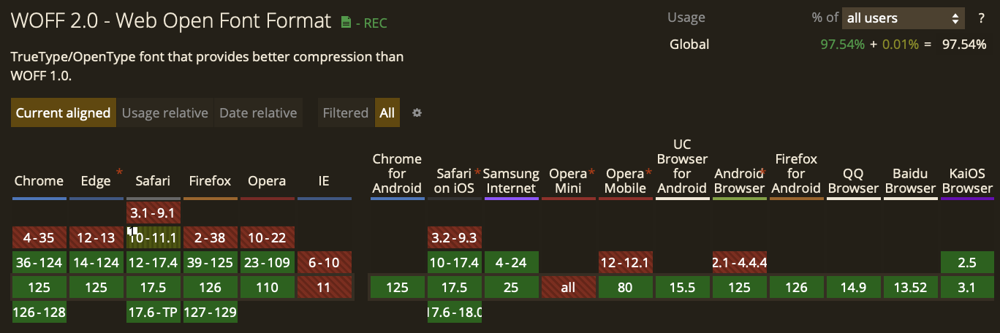
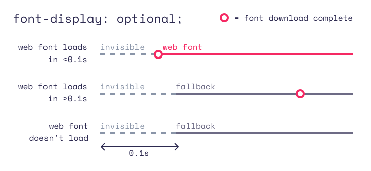

# 폰트 로딩이 늦어지면 발생하는 문제 - FOUT와 FOIT

`FOUT(Flash Of Unstyled Text)`는 **폰트가 다운로드되기 전에 폰트가 적용되지 않은 글자가 보이는 현상**을 말하고, `FOIT(Flash Of Invisible Text)`는 **폰트가 다운로드되기 전에 글자가 보이지 않는 현상**을 말합니다.

다음은 `FOUT`의 예시입니다. 처음에는 폰트가 적용되지 않은(unstyled) 글자가 보였다가 이후 폰트가 적용된 글자가 보입니다.


다음은 `FOIT`의 예시입니다. 폰트가 적용된 글자가 처음에는 보이지 않았지만(invisible) 이후 나타납니다. (\*느린 3G 환경)


폰트는 비동기적으로 로딩하는 리소스기 때문에 로딩 시간이 소요되며 로딩 시간이 소요됨에 따라 FOUT와 FOIT 같은 현상이 발생할 수 있습니다. 만약 네트워크 상황이 좋지 않거나 폰트 파일의 크기가 크다면 로딩 시간이 더 길어질 것입니다.

FOUT, FOIT과 같은 현상은 사용자로 하여금 좋지 않은 첫 인상을 남기거나 레이아웃 쉬프트가 발생하여 UX를 저해할 수 있기 때문에 현상이 두드러진다면 개선이 필요합니다.

그럼 어떻게 하면 폰트를 더 빠르게 로드할 수 있을까요?

# 폰트를 더 빠르게 로드할 수 있는 방법

## 폰트 사이즈 줄이기

기본적으로 네트워크 요청에서는 사이즈가 큰 리소스보다 사이즈가 작은 리소스를 더 빠르게 로드할 수 있습니다. 그렇기 때문에 폰트 사이즈가 너무 크다면 사이즈를 줄이는 것이 최적화에 도움이 됩니다.

### WOFF2 형식 사용하기

WOFF 형식은 압축 기능이 내장되어 있기 때문에 EOT나 TTF 형식보다 효율적입니다. 그리고 WOFF2는 WOFF보다 최대 30% 더 나은 압축을 제공합니다.

WOFF2는 IE와 Opera Mini를 제외한 모든 브라우저에서 지원하고 있으니 해당 브라우저를 지원해야 하는 것이 아니라면 WOFF2 형식을 사용하는 것이 좋습니다.



(\*caniuse 사이트 검색)

```tsx
@font-face {
  font-family: 'Awesome Font';
  font-style: normal;
  font-weight: 400;
  src: local('Awesome Font'),
       url('/fonts/awesome-l.woff2') format('woff2'); /* 형식 설정하기 */
  unicode-range: U+000-5FF;
}
```

### subset 설정하기

필요한 문자만을 포함하는 더 작은 폰트 파일을 만들어 폰트를 적용하려는 글자에 해당하는 폰트만을 로드하는 방법입니다. 특히 아시아 언어에서는 글리프(개별 문자) 수가 서양 언어보다 훨씬 많기 때문에 유니코드 범위를 셋팅함으로써 다운로드하기 더 빠르고 효율적인 서브셋을 만들 수 있습니다.

```tsx
@font-face {
  font-family: 'Awesome Font';
  font-style: normal;
  font-weight: 400;
  src: local('Awesome Font'),
       url('/fonts/awesome-l.woff2') format('woff2');
  /* 유니코드 범위 설정하기 */
  unicode-range: U+000-5FF;
}
```

## 폰트 미리 로드하기

폰트를 높은 우선순위의 리소스로 지정하여 빠르게 가져오도록 할 수 있습니다.

```tsx
<link rel="preload" href="/fonts/..." />
```

그런데 preload를 사용하면 기존 콘텐츠 협상 전략을 우회하기 때문에 글꼴이 사용되지 않더라도 반드시 다운로드하게 됩니다. 따라서 preload 하는 폰트가 많다면 이 방법이 효율적이지 못할 수 있으니 첫 뷰포트에 노출되는 폰트 같이 꼭 미리 로드가 필요한 경우에 사용해야 합니다.

# 폰트 렌더링 전략 선택하기

폰트 로드를 최적화하는 것 말고도 폰트가 로드되기까지 어떻게 렌더링을 수행할 것인지를 결정하는 최적화를 할 수도 있습니다.

아직 로드되지 않은 폰트가 있을 때, 브라우저는 정해진 기본 동작에 따라 텍스트를 어떻게 렌더링할지 결정합니다.

| 브라우저       | 기본 동작                                                                                                                          |
| -------------- | ---------------------------------------------------------------------------------------------------------------------------------- |
| Chrome 및 Edge | 최대 3초 동안 텍스트를 숨기고, 그 이후에는 폰트가 준비될 때까지 시스템 폰트를 사용해 텍스트를 보여주며 준비가 완료되면 폰트를 전환 |
| Firefox        | 최대 3초 동안 텍스트를 숨기고, 그 이후에는 폰트가 준비될 때까지 시스템 폰트를 사용해 텍스트를 보여주며 준비가 완료되면 폰트를 전환 |
| Safari         | 폰트가 준비될 때까지 텍스트를 숨김                                                                                                 |

위 동작(전략)을 @font-face에서 `font-display` api를 사용해 변경할 수 있습니다.

| 값       | 차단 기간            | 스왑 기간            |
| -------- | -------------------- | -------------------- |
| auto     | 브라우저에 따라 다름 | 브라우저에 따라 다름 |
| swap     | 0밀리초              | 무한                 |
| block    | 2-3초                | 무한                 |
| fallback | 100밀리초            | 3초                  |
| optional | 100밀리초            | 없음                 |

*차단 기간: 브라우저가 웹 폰트를 요청할 때부터의 시간
*스왑 기간: 차단 기간 이후의 시간으로 웹 폰트를 사용할 수 있게 되면 교체되는 시간

### font-display: swap


**폰트가 로드되기 전까지 fallback 폰트로 텍스트를 보여주고, 다운로드가 완료되면 웹 폰트로 텍스트를 보여주는 전략**입니다.

폰트가 로드되지 않았더라도 사용자가 텍스트를 확인할 수 있고 다운로드가 완료되면 바로 웹 폰트를 적용하기 때문에 텍스트 렌더링을 가장 적게 지연시킨다는 장점이 있습니다.

하지만 fallback 폰트와 웹 폰트가 크게 다르거나 폰트의 로드가 늦어지면 레이아웃 쉬프트가 크게 체감될 수 있다는 단점이 있습니다.

그래도 텍스트를 가능한 빨리 표시할 수 있고 웹 글꼴로 렌더링하는 게 중요한 경우에 가장 선호되는 접근 방식입니다.

### font-display: block


**폰트가 로드되기 전까지 텍스트를 숨기고 로드가 완료되면 폰트가 적용된 텍스트를 보여주는 전략(FOIT)**입니다. 단, 폰트 로드가 3초보다 길어진다면 fallback 폰트로 텍스트를 렌더링한 후, 로드가 완료되었을 때 교체합니다.

텍스트가 폰트로 표시되는 것이 가장 중요한 상황에서 사용하기 좋은 전략입니다.

### font-display: fallback


**0.1초 동안 텍스트를 숨기고 그 이후에는 fallback 폰트로 텍스트를 렌더링하며, 다운로드가 3초 안에 완료되지 않는다면 웹 폰트의 로드가 완료되더라도 웹 폰트로 교체하지 않는 전략**입니다(fallback 폰트를 계속 보여줍니다).

웹 폰트가 크게 중요하지 않는 상황에서 사용하기 좋은 전략입니다.

### font-display: optional



**텍스트를 숨기는 0.1초 동안 폰트가 로드되지 않으면 fallback 폰트로 렌더링하는 전략**입니다.

텍스트 렌더링이 0.1초동안만 지연되고 폰트 교체로 인한 레이아웃 쉬프트가 없기 때문에 가장 성능이 우수한 접근 방식이지만, 폰트가 늦게 로드된다면 사용되지 않습니다.

성능이 가장 중요한 상황에서 사용하기 좋은 전략입니다.

# 출처

[https://iainbean.com/posts/2021/5-steps-to-faster-web-fonts/](https://iainbean.com/posts/2021/5-steps-to-faster-web-fonts/)

[https://web.dev/articles/avoid-invisible-text?hl=ko](https://web.dev/articles/avoid-invisible-text?hl=ko)

# requestIdleCallback란?

브라우저가 **유휴 상태(idle)일 때 실행할 콜백**을 예약할 수 있는 메서드입니다.

이 메서드를 사용하면 브라우저 메인 스레드가 바쁠 때는 해당 작업을 연기하고, 한가할 때 수행할 수 있습니다. 따라서 우선순위가 낮은 백그라운드 작업을 수행할 때 유용합니다.

## Usage

```jsx
var handle = window.requestIdleCallback(callback[, options])
```

- `callback`: 유휴 상태에 호출할 함수. `IdleDeadline` 객체를 인수로 받음
- `options`: 옵셔널 매개변수. 콜백이 반드시 호출되어야 하는 최대 시간을 나타내는 `timeout` 속성을 가짐

### IdleDeadline 객체

callback 함수에게 전달되는 객체로, 다음과 같이 구성됩니다.

- `timeRemaining()`: 브라우저가 다음 작업을 실행하기 전까지 얼만큼의 시간이 남았는지를 밀리초 단위로 반환
- `didTimeout`: 브라우저가 아직 유휴 상태가 되지 않았지만, 설정한 timeout 시간이 지나 콜백이 호출되었음을 나타내는 boolean 값

# 언제 사용할까?

기존에는 필수적이지 않은 작업을 추후에 실행되도록 개발자가 직접 예약하는 것이 매우 번거로웠지만, 브라우저는 언제 유휴 상태가 되는지 알고 있기 때문에 `requestIdleCallback`라는 API가 등장하게 되었습니다.

요즘 웹사이트에서는 실행해야 할 스크립트가 매우 많습니다. 그래서 스크립트를 최대한 빨리 실행해야 하지만, 동시에 메인 스레드를 오래 점유하여 사용자에게 방해가 되지 않도록 하는 것이 중요합니다. 따라서 자바스크립트의 실행에 있어서 최적화가 필요한 경우 `requestIdleCallback`을 사용하면 좋습니다.

# 사용 예시

유휴 상태에 실행할 콜백 함수를 `requestIdleCallback`에게 넘겨주면 됩니다.

```jsx
function myNonEssentialWork(deadline) {
  // 유휴 시간 동안 실행하기
  while (deadline.timeRemaining() > 0 && tasks.length > 0) {
    doWorkIfNeeded();
  }

  if (tasks.length > 0) {
    // 해야 할 일이 남았다면
    requestIdleCallback(myNonEssentialWork); // 다음 유휴 때 마저 실행하기
  }
}

requestIdleCallback(myNonEssentialWork);
```

단, 브라우저가 **매우 바쁜 상황**이라면 콜백이 호출되기 까지 오랜 시간이 걸릴 수 있습니다.

나중에 실행되어도 괜찮지만, 특정 시간 안에는 실행됐으면 하는 상황이라면 `timeout` 옵션을 주어 해결할 수 있습니다.

```jsx
requestIdleCallback(processPendingAnalyticsEvents, { timeout: 2000 });
```

2초라는 시간이 지나서 콜백이 실행되면, `deadline` 객체는 다음과 같이 구성됩니다.

- `timeRemaining()`은 `0`을 반환함
- `didTimeout`은 `true`가 됨

단, timeout 옵션을 주는 것은 사용자에게 중단이 발생(버벅거림)할 수 있어 주의가 필요합니다. 가능하다면 브라우저가 콜백을 호출할 시점을 결정하도록 냅두는 것이 좋습니다.

# 호환성 문제

이 메서드는 실험적 기능으로, **현재 대부분의 브라우저에서 지원하지만 Safari(iOS)에서는 지원되지 않습니다.**

따라서 메서드의 사용 가능 여부를 확인한 다음, 지원하지 않는다면 환경이라면 setTimeout으로 직접 구현하거나 [폴리필](https://www.npmjs.com/package/requestidlecallback-polyfill)을 사용해야 합니다.

```jsx
if ("requestIdleCallback" in window) {
  // Use requestIdleCallback to schedule work.
} else {
  // Do what you’d do today.
}
```

# 참고

[https://developer.mozilla.org/ko/docs/Web/API/Window/requestIdleCallback](https://developer.mozilla.org/ko/docs/Web/API/Window/requestIdleCallback)

[https://developer.chrome.com/blog/using-requestidlecallback?hl=ko](https://developer.chrome.com/blog/using-requestidlecallback?hl=ko)
